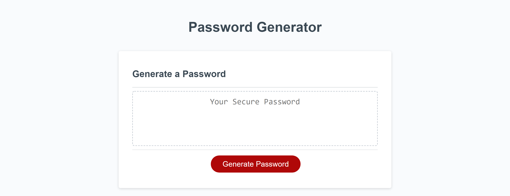
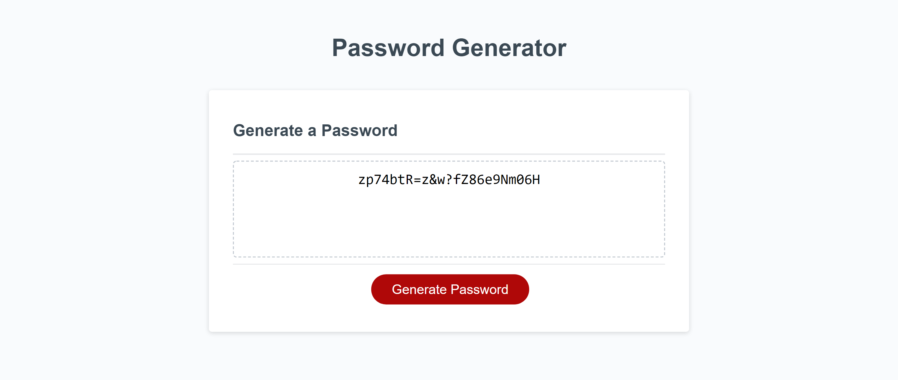

# Chalenge 03
## Password Generator

 

### Description:
This is a password generator that allows a user to select a password length, and which character types to use in the password.

Character type sets are: 
  
 * lowercase 
 * uppercase. 
 * numbers. 
 * special characters. 

Incorect inputs are alerted to and re-prompted.

 

[Click here to view page online](https://sewprano.github.io/03ch-JS-password-generator/)

 

